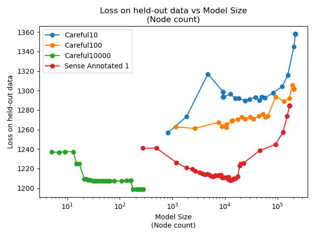
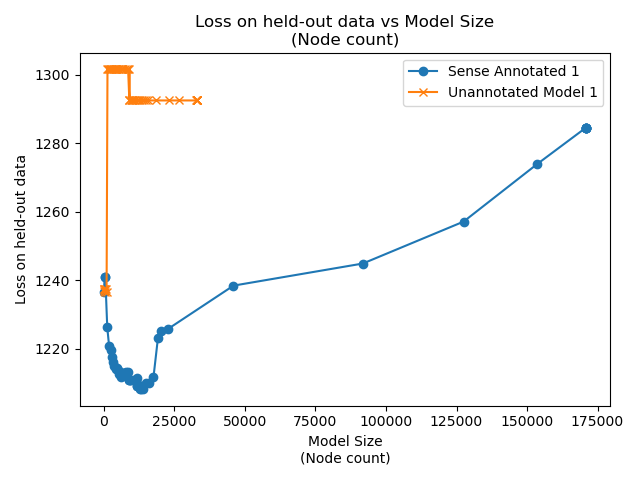
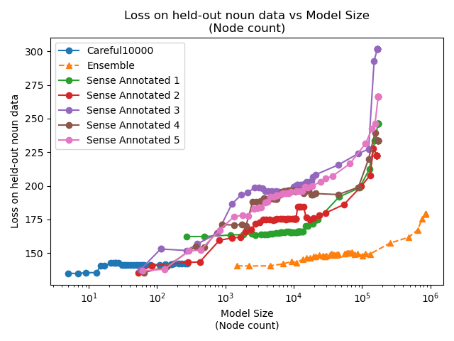
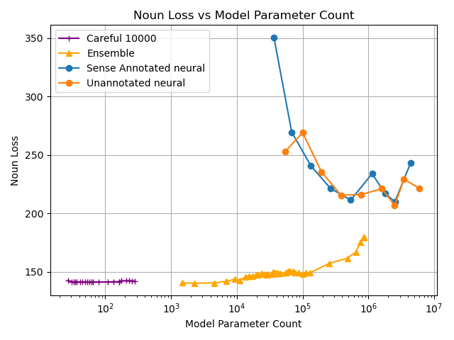
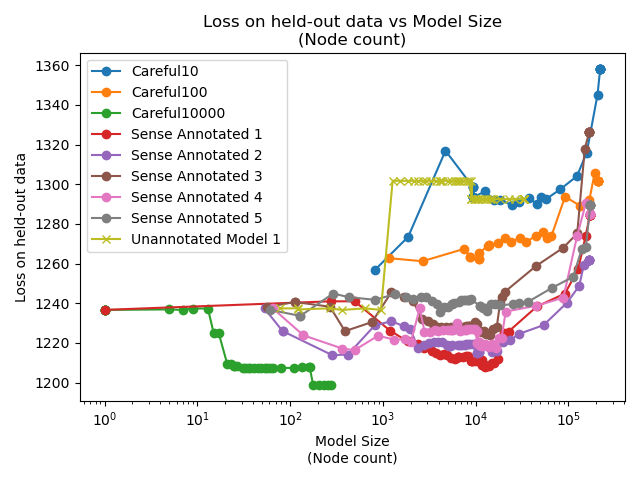
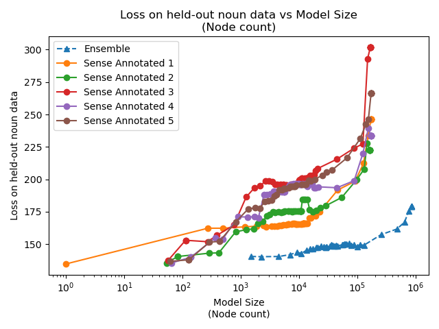
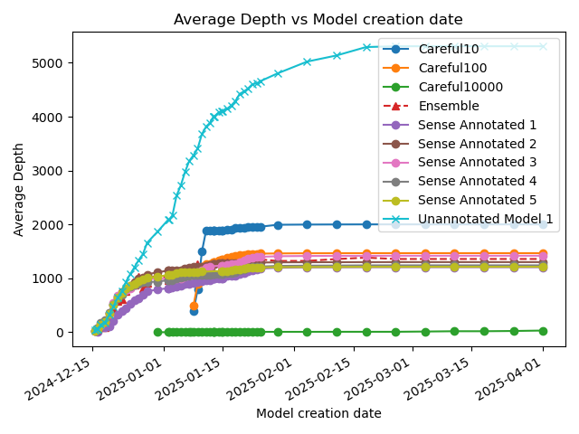
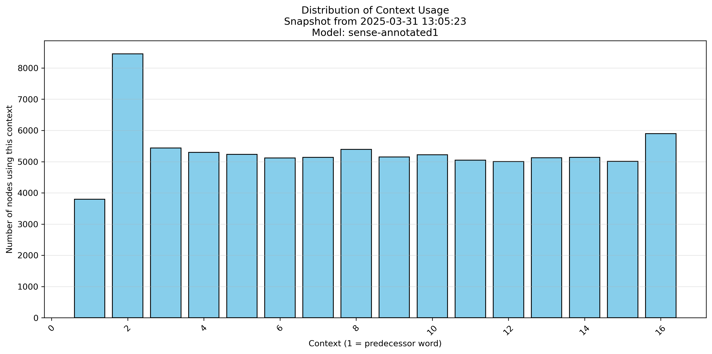

# ultratree-results
This shows the results of the ultrametric tree-based, explainable, solar-powered language model

These charts update each day.

## Key Charts

### Levels of carefulness

Training up an ultrametric tree by finding the optimal split at each step is computationally prohibitive.
We can only subsample. Each order of magnitude increase in carefulness is roughly three orders of magnitude
more compute time required. "Sense Annotated 1" is the alias of the first training of Careful1000, which seems
like a reasonable compromise. It requires about 100 times as many nodes to achieve the same result
as Careful10000, but it can train 1000 times faster.

Careful100 and Careful10 are much, much faster to train, but there's a threshold somewhere between Careful100
and Careful1000 where there are too many bad choices. It's open question what that threshold is, and why a
threshold even exists.

### Does sense annotation work?

The key question that this work set out to answer was whether sense annotation, and indeed, the whole
idea of synergistic semantic and statistical models were worth exploring. 

The "Unannotated Model 1" can be seen as being a baseline statistical model. It's equivalent to a one-hot
encoded decision tree. The sense annotated model's learning generalises where the unannotated model
is overfitting very early.

### Reproducibility and variance in models

Broadly speaking, re-training on the same data yields similar results. Loss on the hold-out training
data goes down, roughly linearly with the logarithm of the number of nodes in the model. Note that these
are only sorted by time (the model that was trained first). It's just co-incidence that model 1 is the best
and model 5 the worst.

Even the worst model is doing much better than the unannotated model. The probability of this happening 
by chance is 1/32, which is equivalent to a p-value of 0.03.

### Ensembling

Ensembling works. The ensemble of 5 "Careful 1000" models gets results that don't look all that different
to an extrapolation of the best of them.

### Baseline Comparison

Comparison with a neural baseline shows that the best-trained
ultrametric trees need a few orders of magnitude more
nodes than a neural network needs trainable parameters. But different ultrametric training regimes
have several orders of magnitude difference within them, so it's not hard to believe that a 
better training regime might close this gap.

Weirder is that here sense annotation makes barely any difference to the neural network models.

### Noun loss

Instead of looking at the total loss over all parts of speech, we
would expect that nouns would get the most benefit from having sense
annotation into a hierarchy.

But the data shows the exact opposite: as we train, we are *increasing* the loss on nouns,
which means that the loss on all other parts of speech much be dropping even more rapidly.

We do see that the ultratree models soundly outperform neural network models on nouns though.
Neural networks are behaving as one would expect: larger models have more generalised learning.

## Everything Else

### Total Loss

### Noun Loss

### Time Views

### Model Complexity

### Context Usage

# How to reproduce these results

## Download the TinyStories data set, and sense-annotate some of it

Clone `github.com:solresol/wordnetify-tinystories.git` 

Follow the instructions in the README.md there.

I stored the sense-annotated training data in `/tinystories/wordnetify-tinystories/TinyStories.sqlite` and the sense-annotated validation data in `/tinystories/wordnetify/w2.sqlite`

## Make an ultrametric tree model

Clone `github.com:solresol/ultrametric-trees` and follow the instructions
in README.md there, including running the `cronscript.sh` to export results.

I stored the prepared data (and did training) in
`/ultratree/language-model/tiny.sqlite` and the the validation data
in `/ultratree/language-model/validation.sqlite`

## Make a baseline comparison

Clone `github.com:solresol/ultratree-neural-baseline` and follow the
instructions in the README.md file there.

