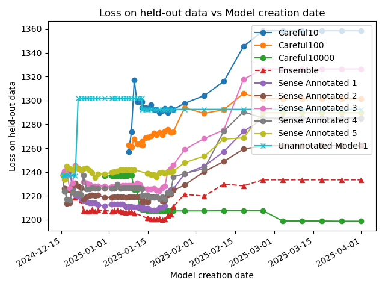
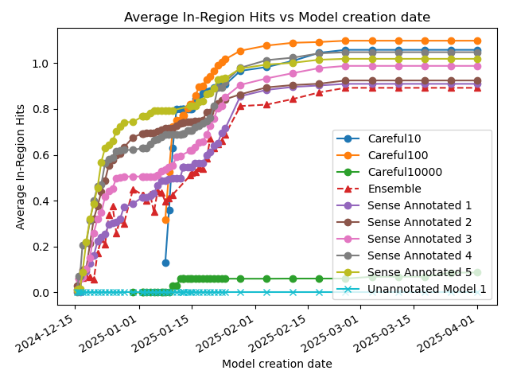

# ultratree-results
This shows the results of the ultrametric tree-based, explainable, solar-powered language model

These charts update each day.


## Time Views




## Model Complexity





# How to reproduce these results

## Download the TinyStories data set, and sense-annotate some of it

Clone `github.com:solresol/wordnetify-tinystories.git` 

Follow the instructions in the README.md there.

I stored the sense-annotated training data in `/tinystories/wordnetify-tinystories/TinyStories.sqlite` and the sense-annotated validation data in `/tinystories/wordnetify/w2.sqlite`

## Make an ultrametric tree model

Clone `github.com:solresol/ultrametric-trees` and follow the instructions
in README.md there, including running the `cronscript.sh` to export results.

I stored the prepared data (and did training) in
`/ultratree/language-model/tiny.sqlite` and the the validation data
in `/ultratree/language-model/validation.sqlite`

## Make a baseline comparison

Clone `github.com:solresol/ultratree-neural-baseline` and follow the
instructions in the README.md file there.


# Troubleshooting

## Duplicate Column Names

When running the script, you might encounter an error related to duplicate column names in your data source, such as a database or CSV file. This can cause issues when sorting or processing the data.

### How the Script Handles Duplicate Columns

The script automatically detects duplicate column names and renames them to make them unique. It appends a suffix to the duplicate column names to differentiate them. This is logged for your reference.

### Checking for Duplicate Column Names

To manually check for duplicate column names in your database or CSV files, you can use the following methods:

- **For SQLite Databases**: Use a SQL query to list all column names and check for duplicates.
  ```sql
  PRAGMA table_info(your_table_name);
  ```

- **For CSV Files**: Open the CSV file in a text editor or spreadsheet software and inspect the header row for duplicates.

### Resolving Duplicate Column Names

If you find duplicate column names, consider renaming them in the source data to ensure they are unique. This will prevent potential issues during data processing and analysis.


