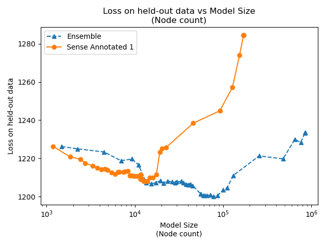
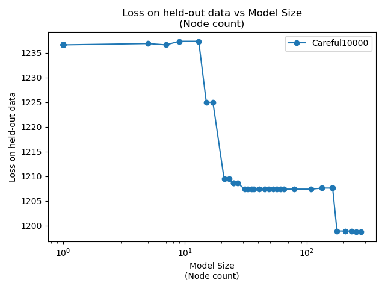
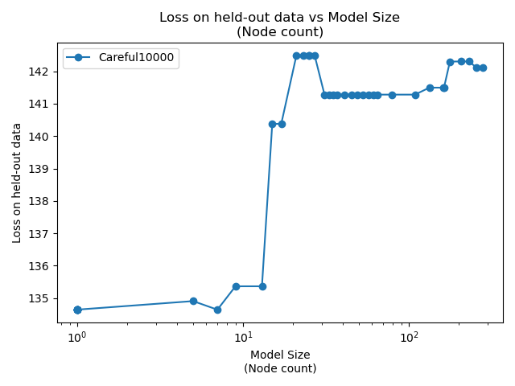
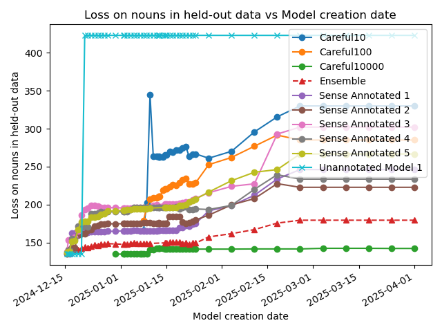
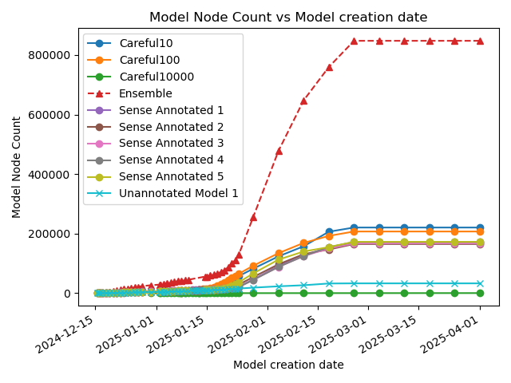
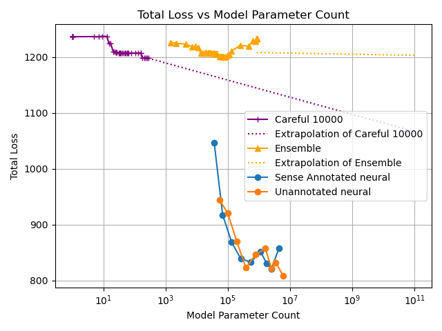
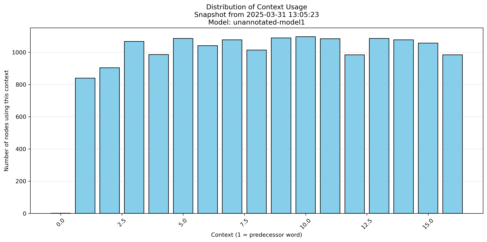

# ultratree-results
This shows the results of the ultrametric tree-based, explainable, solar-powered language model

These charts update each day.

## Total Loss

## Noun Loss

Instead of looking at the total loss over all parts of speech, we would expect that nouns would get the most benefit from
having sense annotation into a hierarchy.

## Time Views

## Neural Network

This plot shows the Total Loss vs Model Parameter Count for different augmentations of neural network models, together with a sample sense annotated, and unannotated model for comparison.

To-do: if the ensemble looks good, add it to the chart

## Model Complexity

## Context Usage

# How to reproduce these results

## Download the TinyStories data set, and sense-annotate some of it

Clone `github.com:solresol/wordnetify-tinystories.git` 

Follow the instructions in the README.md there.

I stored the sense-annotated training data in `/tinystories/wordnetify-tinystories/TinyStories.sqlite` and the sense-annotated validation data in `/tinystories/wordnetify/w2.sqlite`

## Make an ultrametric tree model

Clone `github.com:solresol/ultrametric-trees` and follow the instructions
in README.md there, including running the `cronscript.sh` to export results.

I stored the prepared data (and did training) in
`/ultratree/language-model/tiny.sqlite` and the the validation data
in `/ultratree/language-model/validation.sqlite`

## Make a baseline comparison

Clone `github.com:solresol/ultratree-neural-baseline` and follow the
instructions in the README.md file there.

